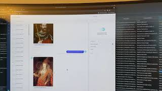

# lockebot

**LockeBot:** a demonstration of implementing a basic question answering bot with use of [Rasa](https://rasa.com/) and a database.

**NB: The code is undergoing an update so expect some changes compared to the old version and it is not completely "neatened up" yet! :smiley:**

## What is this?

It is a bot that can answer simple questions via Rasa X plus any other interfaces Rasa supports and with extra work it can even be voice-enabled (see demo video)

After being trained on examples, it is (to a degree) able to generalise the questions and respond to a broad range of similar questions. The questions are turned into intents and entities, which are then used to construct queries to run against a database to provide the answer.

The demostration topic is the UK monarchy with the answers derived from a simple table of the kings and queens.

If you want to see the older version it's [here](https://github.com/nmstoker/lockebot/tree/a1abc8283189125dd456b65dcc7c900e3e0b8385).

## Install

** A work in progress - steps need refinement and may be missing **

Ensure you have Python 3.5+ installed (Python version requirements TBC)

* Git clone from this repo
	* `git clone https://github.com/nmstoker/lockebot mybotfoldername` - *replace __mybotfoldername__ with any valid name you like*
	* `cd mybotfoldername`
* Create a virtual environment (optional but recommended)
* Activate the virtual environment
* Use pip install
	* `pip install -r requirements.txt`
* Install Rasa / Rasa X - **UPDATE DETAILS**
	* https://rasa.com/docs/rasa/installation
* Train models (see below, Usage)

### Additional installation choices

#### Voice UI

I plan to update this section to demonstrate how to extend the bot to be voice-enabled for local use.

See a YouTube demonstration here: https://youtu.be/8aqiVI3ITr8

#### Other UI Options

See details of the various Channel Connectors in [Rasa documentation](https://rasa.com/docs/rasa/connectors/your-own-website)

It should be feasible to connect it to any Channel Connectors or even a custom one that works with Rasa but this is up to you.

#### Raspberry Pi installation

*UPDATE THIS* 

## Usage

### Training

The main files to focus on for training are:
* [domain.yml](domain.yml) for some overall settings and responses
* and under the [data directory](data):
	* for intents and entities, there is [RoyBot.yml](data/RoyBot.yml)
	* for the "stories" (ie typical sequences the conversation may follow) there is [stories.yml](data/stories.yml)

See the [Rasa documentation here](https://rasa.com/docs/rasa/) for details of the format and options for editing it.

*UPDATE THIS* 

### Regular Bot Use

*UPDATE THIS* 

* **Start Rasa Action server:** in a first terminal activate your virtual environment, then enter: `rasa run actions --auto-reload`
	You should see successful output including:

	> Action endpoint is up and running on http://localhost:5055
* **Start Rasa X:** in a second terminal also activate your virtual environment, then enter: `rasa x`
	You should see it launch with a browser page opened automatically
	The terminal will also show something along the lines of:

	> The server is running at http://localhost:5002....

* (if running voice-enabled) start [SimpleSpeechLoop](https://github.com/nmstoker/SimpleSpeechLoop) in a third terminal (NB: repo currently does not include updates for this integration to work)
* Interact via Rasa X on the ["Talk to your bot" page](http://localhost:5002/interactive)

## Platforms
Currently it is only tested on **Linux** (specifically [Arch](https://www.archlinux.org/) x86-64.

In due course I would be interested like to support Windows and Mac - I have access to the former but not the latter, so if there's anyone keen to look into this on the Mac, volunteers will be gratefully received.

## Technical background

*UPDATE THIS* 

## Name origin
LockeBot gets its name from a weak pun. It is built on Rasa, and [John Locke](https://en.wikipedia.org/wiki/John_Locke) (the philospher) was notable for his work in relation to the empty slate arguments regarding the mind, called tabula rasa.

## RoyBot data
The sqlite database for RoyBot has been populated with information gleened from public sources on the web, chiefly:

* https://en.wikipedia.org/wiki/List_of_English_monarchs
* https://en.wikipedia.org/wiki/List_of_British_monarchs
